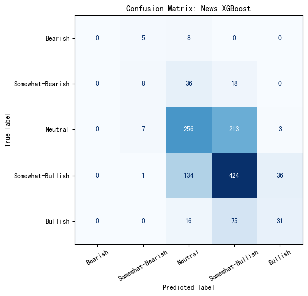

# Predict Stock Direction With Supervised Learning

Course: [BU CS 506 Final Project](https://gallettilance.github.io/final_project/)

## Presentation Video

YouTube link: [Project Presentation](https://youtu.be/02thZ96sEEA)


## Quick Navigation

- [Build and Run](#build-and-run-most-important)
- [Testing and GitHub Workflow](#testing-and-github-workflow)
- [Project Overview and Goal](#project-overview-and-goal)
- [Data Collection](#data-collection)
- [News Processing Notebook](#news-processing-notebook)
- [Data Cleaning](#data-cleaning)
- [Feature Extraction](#feature-extraction)
- [Modeling](#modeling)
- [Visualizations of Data](#visualizations-of-data-interactive-encouraged)
- [Results](#results)
- [Limitations and Future Work](#limitations-and-future-work)
- [Team Contributions](#team-contributions)


## Build and Run (Most Important)

### Environment


| Item         | Value              |
| ------------ | ------------------ |
| OS           | macOS, Linux       |
| Python       | 3.10+              |
| Dependencies | `requirements.txt` |
| Task runner  | `Makefile`         |


### Quick Start

```bash
make install
make test
make fetch-data   # optional if you want fresh raw data
make reproduce
```

`make reproduce` runs:

- `scripts/data/process_data.py`
- `scripts/training/train_logistic.py`
- `scripts/training/train_random_forest.py`

The notebook-based news workflow is separate from `make reproduce`. To run it, launch Jupyter and open `scripts/notebooks/process_news.ipynb`.

## Testing and GitHub Workflow

[](https://github.com/MarcoZengg/predicting-stock-direction/actions/workflows/ci.yml)

### Code/files used

- `tests/test_smoke.py`
- `.github/workflows/ci.yml`

### Output artifacts

- Passing local test run with `make test`
- Passing CI run on push/PR

## Project Overview and Goal

### Label definition

$$  
y_{t+1} =  
\begin{cases}  
1, & 
\text{if the return from day } t \text{ to } t+1 \text{ is positive} \\
0, & 
\text{otherwise}\\
\end{cases}  
$$

### Motivation

Predicting exact next-day prices is typically too noisy for small academic projects, but directional prediction is a practical and measurable objective. The binary target is directly useful for comparing models, evaluating signal quality, and discussing whether engineered features contain predictive information beyond naive baselines.

### Goal

- Predict next-day direction (up/down) for `SPY`, `QQQ`, and `IWM`.
- Compare linear and non-linear supervised models.

### Architecture and data flow


---

## Data Collection

### What this section covers

Where data comes from and how it is pulled.

### Code/files used

- `scripts/data/fetch_data.py`
- `data/raw/{TICKER}_historical.csv`

### Output artifacts

- Raw OHLCV data for `SPY`, `QQQ`, `IWM` in `data/raw/`

### Source summary


| Item        | Details                            |
| ----------- | ---------------------------------- |
| Source      | Yahoo Finance (`yfinance`)         |
| Assets      | `SPY`, `QQQ`, `IWM`                |
| Pull script | `scripts/data/fetch_data.py`       |
| Output path | `data/raw/{TICKER}_historical.csv` |


ETFs (`SPY`, `QQQ`, `IWM`) were selected instead of individual stocks to reduce idiosyncratic company-level noise (e.g., earnings surprises, one-off corporate events) and focus on broader market behavior. This makes the directional-label task more stable, improves comparability across assets, and better matches the project goal of testing whether generalizable market features can predict next-day direction.

### Data coverage


| Ticker | Start Date | End Date   | Total Rows | Train Rows | Test Rows |
| ------ | ---------- | ---------- | ---------- | ---------- | --------- |
| `SPY`  | 2010-02-02 | 2025-12-29 | 4,000      | 3,200      | 800       |
| `QQQ`  | 2010-02-02 | 2025-12-29 | 4,000      | 3,200      | 800       |
| `IWM`  | 2010-02-02 | 2025-12-29 | 4,000      | 3,200      | 800       |


---

## News Processing Notebook

### What this section covers

What `scripts/notebooks/process_news.ipynb` does and how it connects raw news, transformer embeddings, and downstream experiments on `GOOG`.

### Code/files used

- `scripts/notebooks/process_news.ipynb`
- `scripts/experimental/news_transformer_prototype.py`
- `data/raw/GOOG_historical.csv`

### Output artifacts

- `data/news_data/news_sentiment.csv`
- `data/news_data/news_sentiment_transformer_features.csv`
- `data/news_data/xgboost_classification_metrics.csv`
- `data/news_data/xgboost_classification_predictions.csv`
- `data/news_data/xgboost_classification_report.csv`

### What `process_news.ipynb` does

1. Pulls ticker-specific news from the Alpha Vantage `NEWS_SENTIMENT` API and appends deduplicated rows to `data/news_data/news_sentiment.csv`.
2. Runs `scripts/experimental/news_transformer_prototype.py` to combine each article's title, summary, and source category into one text field and encode it with `distilbert-base-uncased`.
3. Saves the resulting transformer embedding columns as `text_emb_*` features in `data/news_data/news_sentiment_transformer_features.csv`.
4. Trains a multiclass XGBoost model to predict `ticker_sentiment_label` from those embedding features using a chronological split.
5. Trains a logistic-regression baseline on the same embedding table for comparison.
6. Aggregates news-derived predictions by day and aligns them with `GOOG` price history to test whether news features help predict next-day price direction.
7. Produces exploratory plots for sentiment-label frequency, sentiment-score behavior over time, and model comparison outputs.

### How to run it

```bash
jupyter notebook scripts/notebooks/process_news.ipynb
```

Recommended notebook order:

1. Update the Alpha Vantage API key and ticker in the first cell.
2. Run the first cell to refresh `news_sentiment.csv`.
3. Run the next cell to execute `news_transformer_prototype.py` and generate transformer features.
4. Continue through the training, evaluation, alignment, and visualization cells.

### Notes and assumptions

- This workflow is currently focused on `GOOG`; later cells explicitly join against `data/raw/GOOG_historical.csv`.
- The transformer step downloads a Hugging Face model the first time it runs, so internet access is required.
- The notebook is an experimental extension to the main ETF price-direction pipeline and is not part of `make reproduce`.

---

## Data Cleaning

### What this section covers

How raw data is standardized and split.

### Code/files used

- `scripts/data/process_data.py`

### Output artifacts

- `data/processed/{TICKER}_processed.csv`
- `data/processed/{TICKER}_train.csv`
- `data/processed/{TICKER}_test.csv`

### Processing steps

1. Parse and standardize date/price columns.
2. Sort chronologically.
3. Compute returns and label.
4. Drop NaN rows from rolling features.
5. Split 80/20 by time.

### To finalize before submission

Train/Test Split Timeline

Chronological splitting prevents data leakage by ensuring every test observation occurs strictly after the training window, so the model never learns from future information during training.

---

## Feature Extraction

### What this section covers

Feature families used for model input.

### Code/files used

- `scripts/data/process_data.py`
- `scripts/data/feature_engineering.py`
- `results/feature_importance.csv`

### Output artifacts

- Engineered feature columns in `data/processed/*_processed.csv`
- Ranked feature-importance export in `results/feature_importance.csv`

### Feature groups

- Lag returns
- Rolling averages and volatility
- Momentum indicators
- Moving-average ratios
- Volume features

### To finalize before submission

### Feature dictionary (key features)


| Feature          | Type              | Description                                                           |
| ---------------- | ----------------- | --------------------------------------------------------------------- |
| `return`         | Price momentum    | Daily percentage return of the ETF close price                        |
| `lag_return_1`   | Price momentum    | Previous-day return (1-day lag)                                       |
| `lag_return_5`   | Price momentum    | Return lagged by 5 trading days                                       |
| `rolling_mean_5` | Trend             | 5-day moving average of daily returns                                 |
| `rolling_std_10` | Volatility        | 10-day rolling standard deviation of returns                          |
| `momentum_10`    | Trend/momentum    | 10-day price momentum (relative change over 10 days)                  |
| `close_to_ma_10` | Trend strength    | Relative distance between close price and 10-day moving average       |
| `volume_change`  | Volume dynamics   | Day-over-day percent change in traded volume                          |
| `vix_level`      | Market regime     | Market-implied volatility level used as a risk regime proxy           |
| `tnx_level`      | Macro rate signal | 10-year Treasury yield level used as an interest-rate context feature |


### Interpretation of top features

- Rolling return and volatility features (such as `rolling_mean_5` and `rolling_std_10`) appear frequently in high-importance rows, suggesting short-horizon trend/volatility state carries more signal than raw price level alone.
- Cross-asset regime features (`vix_level`, `tnx_level`, and related rate/volatility returns) rank highly in multiple models, indicating that broader market context contributes to next-day direction prediction.
- The mixed signs and modest magnitudes in linear-model coefficients support the project’s core finding: predictive signal exists but is weak, so performance depends on combining many small effects rather than one dominant feature.

---

## Modeling

### What this section covers

Model training setup and evaluation strategy.

### Code/files used

- `scripts/training/train_logistic.py`
- `scripts/training/train_random_forest.py`
- `results/metrics.csv`

### Output artifacts

- Model-level performance metrics in `results/metrics.csv`

### Evaluation metrics


| Metric    | Why this metric matters                          |
| --------- | ------------------------------------------------ |
| Accuracy  | Overall correctness across all predictions       |
| Precision | Reliability of predicted positive class          |
| Recall    | Ability to capture actual positive class         |
| F1        | Balance between precision and recall             |
| ROC-AUC   | Ranking quality across classification thresholds |


### To finalize before submission

### Model comparison (from `results/metrics.csv`)

All Metric Comparisons

Caption: Side-by-side grouped bar charts for Accuracy, Precision, Recall, F1, and ROC-AUC across all ticker/model pairs from the latest regenerated `results/metrics.csv`.  
Takeaway: No single model dominates every metric; Gradient Boosting and Logistic Regression provide stronger balance metrics, while baseline methods can still appear strong on raw accuracy.

Individual metric charts:

Accuracy Comparison
Precision Comparison
Recall Comparison
F1 Comparison
ROC-AUC Comparison

These individual views are included for easier inspection of each evaluation criterion.

---

## Visualizations of Data (Interactive Encouraged)

### What this section covers

Static and interactive visual evidence supporting conclusions.

### Code/files used

- `scripts/visualization/visualization_data.py`
- `scripts/visualization/visualization_train.py`

### Output artifacts

- Figures exported to your image/output folders

### To finalize before submission

**Figure 1 - Price trends by ticker**

Price Trend and Train/Test Split

Caption: SPY price trend with chronological train/test segmentation.  
Takeaway: The split keeps test observations in the latest market regime, which better reflects realistic forward prediction.

**Figure 2 - Class balance across ETFs**

Class Balance Across ETFs

Caption: Up/down label proportions for SPY, QQQ, and IWM after preprocessing.  
Takeaway: All tickers show mild class imbalance toward positive labels, which is why recall and ROC-AUC are reported alongside accuracy.

**Figure 3 - Confusion matrices (all model families on SPY)**

SPY Logistic Confusion Matrix
SPY Random Forest Confusion Matrix
SPY Gradient Boosting Confusion Matrix

Caption: Confusion matrices for logistic regression, random forest, and gradient boosting on SPY.  
Takeaway: All model families are now visualized, enabling side-by-side comparison of error structure rather than relying on a single example model.

**Figure 4 - ROC and PR curves (all model families on SPY)**

SPY Logistic ROC
SPY Random Forest ROC
SPY Gradient Boosting ROC
SPY Logistic PR
SPY Random Forest PR
SPY Gradient Boosting PR

Caption: ROC and precision-recall curves for all three model families on SPY.  
Takeaway: Curves across models can now be compared directly under the same ticker; equivalent sets were also generated for QQQ and IWM.

**Figure 5 - News XGBoost confusion matrix from `process_news.ipynb`**



Caption: Confusion matrix for the multiclass XGBoost model trained on transformer embeddings generated from financial news text in `scripts/notebooks/process_news.ipynb`.  
Takeaway: The model performs best in the middle sentiment bands, especially `Neutral` and `Somewhat-Bullish`, where the diagonal cells are strongest. Most errors occur between neighboring sentiment categories rather than between opposite extremes, which suggests the text embeddings capture general sentiment direction but still struggle to separate subtle intensity differences. A notable limitation is that the model makes almost no `Bearish` predictions, and many true `Bullish` or `Somewhat-Bearish` examples are pulled toward `Neutral` or `Somewhat-Bullish`. This pattern is consistent with class imbalance and semantic overlap in financial headlines: extreme labels are rarer, while moderate sentiment language is more common and harder to distinguish cleanly.

Additional generated outputs for all tickers/models:

- `data/images/all_models/spy/`
- `data/images/all_models/qqq/`
- `data/images/all_models/iwm/`

---

## Results

### What this section covers

Observed outcomes from generated result files.

### Code/files used

- `results/metrics.csv`
- `results/data_summary.csv`

### Output artifacts

- Model performance summary
- Dataset size and class balance summary

### Current highlights

- Majority baseline has high raw accuracy on SPY/QQQ because the class distribution is skewed, but it offers no discrimination (`ROC-AUC = 0.5` by design).
- Best ROC-AUC in the current regenerated run is `0.5546` (IWM Logistic Regression).
- Best F1 in the current regenerated run is `0.2834` (IWM Gradient Boosting), indicating improved balance between precision and recall versus other models.

### Dataset summary

- Around 4,000 rows per ticker
- 3,200 train and 800 test rows per ticker
- Positive label rate around 53% to 56%

### To finalize before submission

### Final comparison summary


| Ticker | Best Accuracy Model | Best ROC-AUC Model  | Best ROC-AUC |
| ------ | ------------------- | ------------------- | ------------ |
| `SPY`  | Random Forest       | Logistic Regression | 0.5382       |
| `QQQ`  | Gradient Boosting   | Logistic Regression | 0.5255       |
| `IWM`  | Gradient Boosting   | Logistic Regression | 0.5546       |


### Did we achieve our goal?

Partially. The project successfully trained and compared multiple supervised models with reproducible chronological evaluation, and several models now exceed random discrimination (`ROC-AUC > 0.5`), with the best at `0.5546` on IWM. However, absolute performance remains modest, so this is evidence of weak but non-zero predictive signal rather than a robust trading-grade predictor.

---

## Limitations and Future Work

### What this section covers

Constraints of current approach and next steps.

### Current limitations

- Daily directional prediction is weak/noisy.
- Accuracy alone can be misleading with class imbalance.
- Results depend on date range and feature choices.

### To finalize before submission

- Better validation plan: use rolling-window backtesting (train on an expanding window and test on the next fixed horizon) to measure temporal stability and reduce single-split sensitivity.
- Expanded feature plan: incorporate aligned news sentiment, macro event indicators, and richer regime-state features to improve signal beyond price/volume-only inputs.
- Practical deployment idea: expose daily probability outputs in a lightweight dashboard as decision support (not automated trading), with alert thresholds and recent model-calibration diagnostics.

---

## Team Contributions


| Team Member  | Main Responsibilities                 |
| ------------ | ------------------------------------- |
| Xiankun Zeng | Data Collection, Feature Engeeneering |
| Haoran Zhang | Data Processing, Feature Engeeneering |
| Hoang Anh Vu | Modeling, Visualization               |
| Lingjie Su   | ...                                   |

## Repository Organization

- `scripts/` - data pipeline and modeling scripts
- `data/raw/` - collected raw datasets
- `data/processed/` - cleaned and split datasets
- `results/` - reproducible summary outputs
- `tests/` - automated test code
- `.github/workflows/` - CI workflow definitions


## License

MIT (see `LICENSE`).